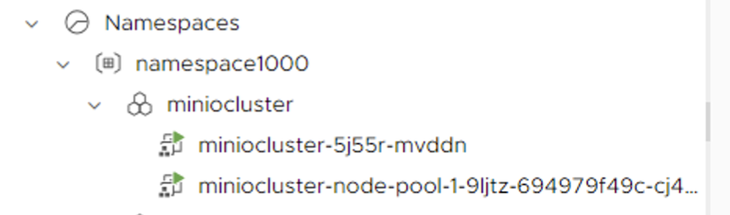

# MinIO Shared Services Deployment 

Make sure you are supervisor Namespace where the shared service cluster is going to be created (in my case namespace1000)

```
k config use-context namespace1000

k get nodes

NAME                               STATUS   ROLES                  AGE   VERSION
4223110e3b11a02b6b177db0551f41ec   Ready    control-plane,master   76d   v1.24.9+vmware.wcp.1
42234f3fd4ee6ad71dde6b4da15622e5   Ready    control-plane,master   76d   v1.24.9+vmware.wcp.1
422398077f99efb5bf4475df395f65f3   Ready    control-plane,master   76d   v1.24.9+vmware.wcp.1

```

Create the cluster

```
kubectl apply -f https://raw.githubusercontent.com/ogelbric/minioSharedServicesCluster/main/miniocluster.yaml

```

Two things to note in the cluster yaml file are 1) a /data mount point and 2) a volume by the name localvolume

```
      - capacity:
            storage: "10Gi"
          mountPath: "/data"
          name: localvolume
```

Checking on our cluster

```
k get clusters
NAME              PHASE         AGE    VERSION
miniocluster      Provisioned   6m9s   v1.23.8+vmware.2
tmclocalcluster   Provisioned   43d    v1.24.9+vmware.1
[root@localhost minio]#

```



Log onto new cluster

```
kubectl vsphere login --server 192.168.2.100 --vsphere-username administrator@vsphere.local --tanzu-kubernetes-cluster-namespace  namespace1000 --tanzu-kubernetes-cluster-name miniocluster --insecure-skip-tls-verify

k get nodes
NAME                                              STATUS   ROLES                  AGE   VERSION
miniocluster-5j55r-mvddn                          Ready    control-plane,master   14m   v1.23.8+vmware.2
miniocluster-node-pool-1-9ljtz-694979f49c-cj4vw   Ready    <none>                 10m   v1.23.8+vmware.2

```
Make cluster usable

```
kubectl apply -f https://github.com/ogelbric/YAML/raw/master/authorize-psp-for-gc-service-accounts.yaml

```

Download the minio yaml file 

```
curl https://raw.githubusercontent.com/minio/docs/master/source/extra/examples/minio-dev.yaml -O
```

The yaml file calls for a certain node label

```
k get nodes
NAME                                              STATUS   ROLES                  AGE   VERSION
miniocluster-5j55r-mvddn                          Ready    control-plane,master   22m   v1.23.8+vmware.2
miniocluster-node-pool-1-9ljtz-694979f49c-cj4vw   Ready    <none>                 18m   v1.23.8+vmware.2

k label node miniocluster-node-pool-1-9ljtz-694979f49c-cj4vw kubernetes.io/hostname=kubealpha.local --overwrite

node/miniocluster-node-pool-1-9ljtz-694979f49c-cj4vw labeled

```

Apply the minio.yaml file 

```
kubectl apply -f minio-dev.yaml

k get pods -n minio-dev

NAME    READY   STATUS    RESTARTS   AGE
minio   1/1     Running   0          45s

kubectl describe pod/minio -n minio-dev

Events:
  Type    Reason     Age   From               Message
  ----    ------     ----  ----               -------
  Normal  Scheduled  82s   default-scheduler  Successfully assigned minio-dev/minio to miniocluster-node-pool-1-9ljtz-694979f49c-cj4vw
  Normal  Pulling    81s   kubelet            Pulling image "quay.io/minio/minio:latest"
  Normal  Pulled     67s   kubelet            Successfully pulled image "quay.io/minio/minio:latest" in 14.134533904s
  Normal  Created    67s   kubelet            Created container minio
  Normal  Started    67s   kubelet            Started container minio

kubectl logs pod/minio -n minio-dev
Formatting 1st pool, 1 set(s), 1 drives per set.
WARNING: Host local has more than 0 drives of set. A host failure will result in data becoming unavailable.
WARNING: Detected default credentials 'minioadmin:minioadmin', we recommend that you change these values with 'MINIO_ROOT_USER' and 'MINIO_ROOT_PASSWORD' environment variables
MinIO Object Storage Server
Copyright: 2015-2023 MinIO, Inc.
License: GNU AGPLv3 <https://www.gnu.org/licenses/agpl-3.0.html>
Version: RELEASE.2023-08-23T10-07-06Z (go1.19.12 linux/amd64)

Status:         1 Online, 0 Offline. 
S3-API: http://192.167.1.4:9000  http://127.0.0.1:9000     
Console: http://192.167.1.4:9090 http://127.0.0.1:9090   

Documentation: https://min.io/docs/minio/linux/index.html
Warning: The standard parity is set to 0. This can lead to data loss.

```
Depoly the ingress services

```
kubectl apply -f https://raw.githubusercontent.com/ogelbric/minioSharedServicesCluster/main/minio-svc.yaml -n minio-dev

k get svc -n minio-dev
NAME    TYPE           CLUSTER-IP     EXTERNAL-IP     PORT(S)        AGE
minio   LoadBalancer   10.96.157.71   192.168.2.108   80:30218/TCP   10s

```


## Inspration Document

https://min.io/docs/minio/kubernetes/upstream/index.html?ref=docs-redirect


